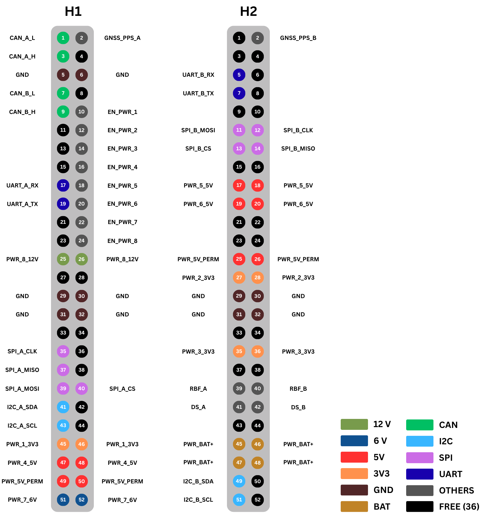

  

<h1 align="center">Architecture and Interfaces</h1>

  <em>System block diagrams and Interface Control Documents (ICD).</em>

 

### What you will find here
- Architecture diagrams (power, data, RF).
- Pinout matrices and bus mapping (I2C, SPI, UART).

### Guidelines
> Always export PDF or PNG versions of diagrams (alongside source files like Draw.io/PlantUML) for easy viewing directly on GitHub.

---

## System Bus Architecture

The system relies on a standardized and highly redundant PC/104-style bus architecture, designed to support modular integration, COTS (Commercial Off-The-Shelf) compatibility, and long-term mission reliability. The bus is divided into two main 52-pin headers (H1 and H2 columns), providing dedicated channels for power distribution, dual-redundant data communication, and critical safety signals.

  

### Bus Design Philosophy & Details

*   **Dual Redundancy:** All critical communication protocols (CAN, UART, SPI, I2C), safety mechanisms (RBF, DS), and timing signals (GNSS_PPS) are split into Channel A and Channel B to ensure the satellite remains operational even if a primary subsystem fails.
*   **Granular Power Control:** The inclusion of `EN_PWR_1` through `EN_PWR_8` allows the On-Board Computer (OBC) to physically cut off or reset power to individual stacked boards remotely. This is a critical mitigation strategy against radiation-induced latch-ups.
*   **Signal Integrity:** Ground (GND) pins are strategically distributed. In addition to the standard central GND block (pins 29-32), dedicated GND pins (H1 5, 6) have been placed near high-speed differential signals like CAN to provide short return paths and minimize Electromagnetic Interference (EMI).
*   **COTS Compatibility:** The bus layout was carefully designed to align with major industry standards, placing fundamental I2C lines and central GND blocks in expected positions to maximize compatibility. Nevertheless, 100% "plug-and-play" integration cannot be guaranteed for all third-party commercial modules. A meticulous integration validation and pin-by-pin check must always be performed prior to incorporating any external hardware to determine if custom interposer boards are necessary.

### Power Distribution Pins

The bus provides a wide range of voltage levels to accommodate various payloads, transceivers, and actuators.

| Voltage Level | H1 Header Pins | H2 Header Pins | Description |
| :--- | :--- | :--- | :--- |
| **BAT+ (Raw Battery)** | - | 45, 46, 47, 48 | Direct, unregulated power from the battery pack. Capable of handling high current loads (e.g., radio transmitters, thermal heaters, deployments). |
| **5V PERM** | 49, 50 | 25, 26 | Permanent 5V line. Remains active as long as the battery has charge. Used for critical wake-up circuits and watchdog timers. |
| **12V (`PWR_8`)** | 25, 26 | - | Regulated 12V line for specific high-power payloads or custom actuators. |
| **6V (`PWR_7`)** | 51, 52 | - | Regulated 6V line. |
| **5V (`PWR_4`, `PWR_5`, `PWR_6`)** | 47, 48 | 17, 18, 19, 20 | Standard regulated 5V lines for logic and general subsystem power. |
| **3.3V (`PWR_1`, `PWR_2`, `PWR_3`)**| 45, 46 | 27, 28, 35, 36 | Standard regulated 3.3V lines for low-voltage microcontrollers and digital sensors. |
| **GND (Ground)** | 5, 6, 29, 30, 31, 32 | 29, 30, 31, 32 | Common system ground. Distributed to minimize return current loops and ensure stable reference voltage across the stack. |

### Communication & Control Pins Explained

#### 1. Communication Protocols
*   **CAN (Controller Area Network):** `CAN_A_L/H` (H1 1, 3) and `CAN_B_L/H` (H1 7, 9). Highly robust differential bus for critical telemetry, housekeeping, and command routing.
*   **I2C (Inter-Integrated Circuit):** `I2C_A_SDA/SCL` (H1 41, 43) and `I2C_B_SDA/SCL` (H2 49, 51). Used for short-distance, low-speed communication with environmental sensors (e.g., temperature, IMUs, magnetometers).
*   **SPI (Serial Peripheral Interface):** SPI_A (H1 35, 37, 39) and SPI_B (H2 11, 12, 13, 14). High-speed synchronous data bus, ideal for moving payload data (cameras, mass storage). Includes Chip Select (`CS`) for targeted device communication.
*   **UART (Universal Asynchronous Receiver-Transmitter):** `UART_A_RX/TX` (H1 17, 19) and `UART_B_RX/TX` (H2 5, 7). Point-to-point serial communication, often used for radio module interfaces or low-level debug consoles.

#### 2. Safety and Deployment
*   **RBF (Remove Before Flight):** `RBF_A` (H2 39), `RBF_B` (H2 40). Hardware kill-switch logical inputs. While the physical pin is inserted on Earth, these lines prevent the Electrical Power System (EPS) from routing battery power to the bus.
*   **DS (Deployment Switch):** `DS_A` (H2 41), `DS_B` (H2 42). Microswitch inputs located on the satellite's external rails. They trigger the first boot sequence and initiate mandatory antenna deployment timers once the satellite is ejected into space.

#### 3. Timing and Control
*   **GNSS_PPS (Pulse Per Second):** `GNSS_PPS_A` (H1 2), `GNSS_PPS_B` (H2 2). A highly accurate timing signal provided by the GNSS receiver. Used to synchronize the internal clocks of all stacked boards down to the microsecond for precise scientific measurements.
*   **EN_PWR (Power Enable):** `EN_PWR_1` to `EN_PWR_8` (H1 10, 12, 14, 16, 18, 20, 22, 24). Logic-level signals driven by the primary computer to toggle the power lines of individual subsystems, providing ultimate control over power budgets and fault recoveries.
*   **FREE (Black Pins):** A total of 36 unallocated pins. These must be strictly managed and documented via a formal Interface Control Document (ICD) before being assigned (e.g., as auxiliary SPI Chip Selects or custom payload triggers) to maintain standard compatibility across the development cycle.